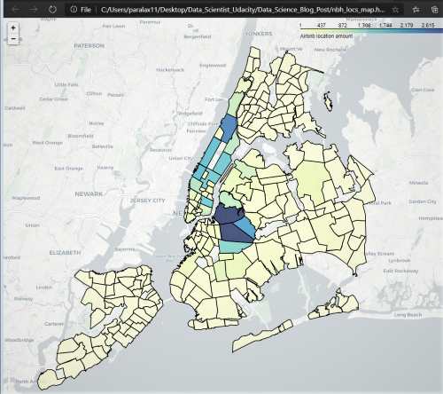
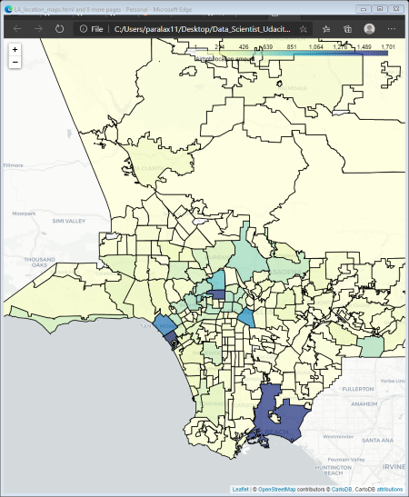

# `Writing-Data-Science-Blog-post Project`
A detail complexities of Jupyter notebook, csv, jpeg/png and geojson files all are accumulated as needed to write a final product of blogpost for data science project.For this project, we will pick multiple set of datasets available from [AirBnB](http://insideairbnb.com/get-the-data.html). In progression writing this blogplost I had to investigate a lot of complicated seraching and analyses for this final blog-post presentation. The analytical blog-post presentation for non-technical readers is available with this link [Medium](.....)

### `Key Steps for Project`
1) Pick all the needed datasets.
2) Pose at least three questions related to business or real-world applications of how the data could be used.
3) Create multiple Python Jupyter Notebooks and infusing statistical analysis in support of my findings.

### `Prepare datasets:`
- Gather necessary data to answer your questions
- Handle categorical and missing data
- Provide insight into the methods I chose and how I chose them
- Analyze, Model, and Visualize key findings
- Provide a clear connection between business questions and how the data answers supports them.

### `Communicate your business insights:`
- Create a Github repository to share your code and data wrangling/modeling techniques, with a technical audience in mind
- Create a blog post to share your questions and insights with a non-technical audience
- Your deliverables will be a Github repo and a blog post.

### `Dataset preprocessing steps:`
I've chosen two data sets from AirBnb sites location is greater Los Angeles CA and New York city area. I tried go as much deeper as possible with 5 sets of main questions all relevant to revenue earning for the AirBnb listers. There are multiple embedded questions were included for detail clarity.

In this project I used two Jupyter notebooks for both LA and NY City datasets. I did indepth data cleaning, feature engineering, natural language processing and  machine learning and data engineering skills as a data scientist.This project will show off my python software skills, including my ability to write clean, organized code!

Here are two screenshots came out as a product of running Jupyter notebooks.
New York City              |  Los Angeles City
:-------------------------:|:-------------------------:
 |  

#### Project submission link: [my project on Github](https://github.com/farhadkpx/Writing-Data-Science-Blog)

### `questionnaires:`
- Where is the existing AirBnb market trends in LA and NY City?
- What types of properties are making headway in attention and revenue?
- How much in average host/listers’ make in revenue earning?
- What time frame is conducive to maximizing revenue?
- Is geolocation a factor in potential earning?
- How should you advertise yourself in virtual space?

### `Description of key files:`
~~~~~~~~
New York City files
1. Part_1_NY_Airbnb_EDA_ML_Analyses.ipynb: Includes original NY Airbnb files with ML processing.
2. Part_2_Questions_NY_Revenue_Analyses.ipynb: Includes Quesionaires for revenue analysi with detail visual.
3. CSV files: NY_listings, NY_reviews, NY_calendar, neighbourhoods.geojson

Los Angeles files
4. Part_1_LA_Airbnb_EDA_ML_Analyses.ipynb: Includes original LA AirBnb files with ML processing.
5. Part_2_Questions_LA_Revenue_Analyses.ipynb: Analyses detail revenue related questionss.
6. CSV files: LA_listings, LA_reviews, LA_calendar, neighbourhoods.geojson
~~~~~~~~~

### `Instructions running Jupyter notebooks:`
I uploaded 4 python-notebook files. You will need to download some package like geopandas, folium and other needed packages to see the detail folium maps.
If intereseted go to AirBnb site below to download all datasets. So you will need altogether 6 csv files 2 geojson files to run both jupyter notebook decisively.
I liked the folium map a lot but run thoes codes you will geopandas and folium package to download.

### Licensing, Acknowledgements
AirBnb must get the credit as the true provider of all the data set at[AirBnb](http://insideairbnb.com/get-the-data.html). I did get great help from 
for [jingwen-z](https://github.com/jingwen-z/python-playground/blob/master/python_for_data_analysis/geovisualization/folium_demo.ipynb) mapping. It's lot of details, have time
then keep reading. Sorry, for unwarranted mistakes.

### `Student Author: Md Ahmed`

