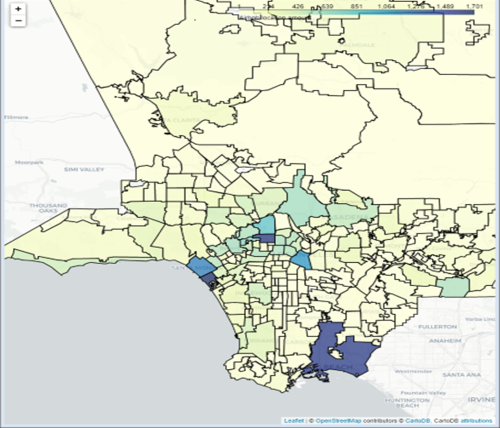

# `Writing-Data-Science-Blog-post Project`
A detail complexities of Jupyter notebook, csv, jpeg/png files all are accumulated on need based to write a final product of blogpost for data science project.For this project, we will pick multiple set of datasets available from [AirBnB](http://insideairbnb.com/get-the-data.html). In pursuing to write this blogplost I had to lot indepth seraching and analyses for a final product.

### `Key Steps for Project`
1) Pick all the needed datasets.
2) Pose at least three questions related to business or real-world applications of how the data could be used.
3) Create a Jupyter Notebook, using any associated packages you'd like, to:

### Prepare datasets:
- Gather necessary data to answer your questions
- Handle categorical and missing data
- Provide insight into the methods you chose and why you chose them
- Analyze, Model, and Visualize
- Provide a clear connection between your business questions and how the data answers them.

### Communicate your business insights:
- Create a Github repository to share your code and data wrangling/modeling techniques, with a technical audience in mind
- Create a blog post to share your questions and insights with a non-technical audience
- Your deliverables will be a Github repo and a blog post.

### Dataset preprocessing steps:
I've chosen two data sets from AirBnb sites location is greater Los Angeles CA and New York city area. I tried go as much deeper as possible with 5 sets of main questions all relevant to revenue earning for the AirBnb listers. There are multiple embedded questions were included for detail clarity.

In this project I used two Jupyter notebooks for both LA and NY City datasets. I did indepth data cleaning, feature engineering, natural language processing and  machine learning and data engineering skills as a data scientist.This project will show off my python software skills, including my ability to write clean, organized code!

Here are two screenshots came out as a product of running Jupyter notebooks.
New York City              |  Los Angeles City
:-------------------------:|:-------------------------:
 |  

#### Project submission link: [my project on Github](https://github.com/farhadkpx/Writing-Data-Science-Blog)

### questionnaires:
- Where is the existing AirBnb market trends in LA and NY City?
- What types of properties are making headway in attention and revenue?
- How much in average host/listers’ make in revenue earning?
- What time frame is conducive to maximizing revenue?
- Is geolocation a factor in potential earning?
- How should you advertise yourself in virtual space?

### Description of key files:
~~~~~~~~
New York City files
1. Par_1_NY_Airbnb_listings_analysis: Includes original NY Airbnb files with ML processing.
2. Part_2_Questions_NY_listings_in_Details: Includes Quesionaires for revenue analysi with detail visual.
3. CSV files: NY_listings, NY_reviews, NY_calendar, neighbourhoods.geojson

Los Angeles files
4. Par_1_LA_Airbnb_listings_analysis: Includes original LA AirBnb files with ML processing.
5. Part_2_Questions_LA_listings_in_Details: Analyses detail revenue related questionss.
6. CSV files: LA_listings, LA_reviews, LA_calendar, neighbourhoods.geojson
~~~~~~~~~

### Instructions running Jupyter notebooks:
I uploaded all the files needed to run these python-notebook files. You will need to download all the files for running these Jupyter notebooks.
I couldn't upload the needed csv files because the size of those files are too big. If intereseted go in AirBnb site below to download all datasets.

### Licensing, Acknowledgements
AirBnb must get the credit as the true provider of all the data set at[AirBnb](http://insideairbnb.com/get-the-data.html). I did get great help from 
for [jingwen-z](https://github.com/jingwen-z/python-playground/blob/master/python_for_data_analysis/geovisualization/folium_demo.ipynb) mapping. It's lot of details, have time
then keep reading. Sorry, for unwarranted mistakes.

### `Student Author: Md Ahmed`

